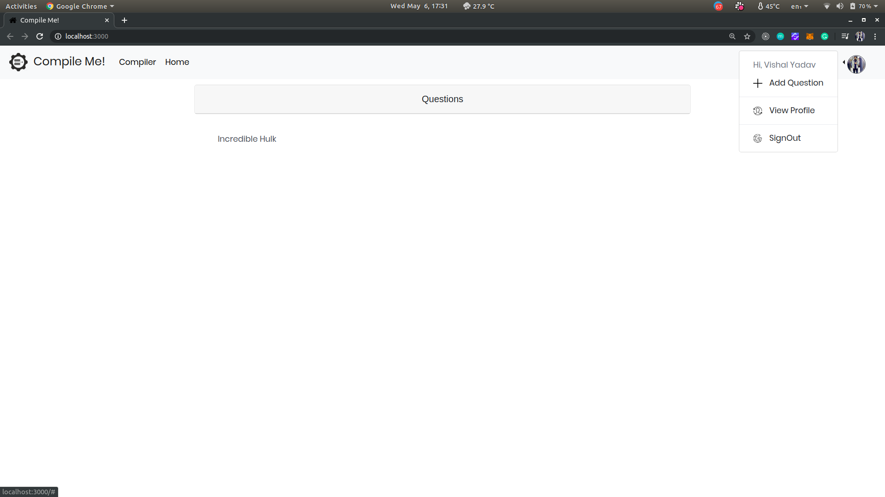
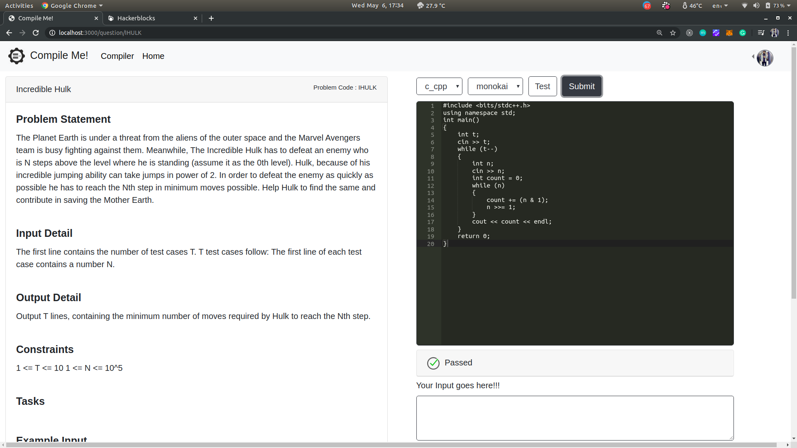

# CompileME

HomePage serves you with a list of questions current just one. Clicking on a question will open the question page.

The question page has a build in compiler to help you submit the code. If the code passes all the  test case then Passed is shown as result.

